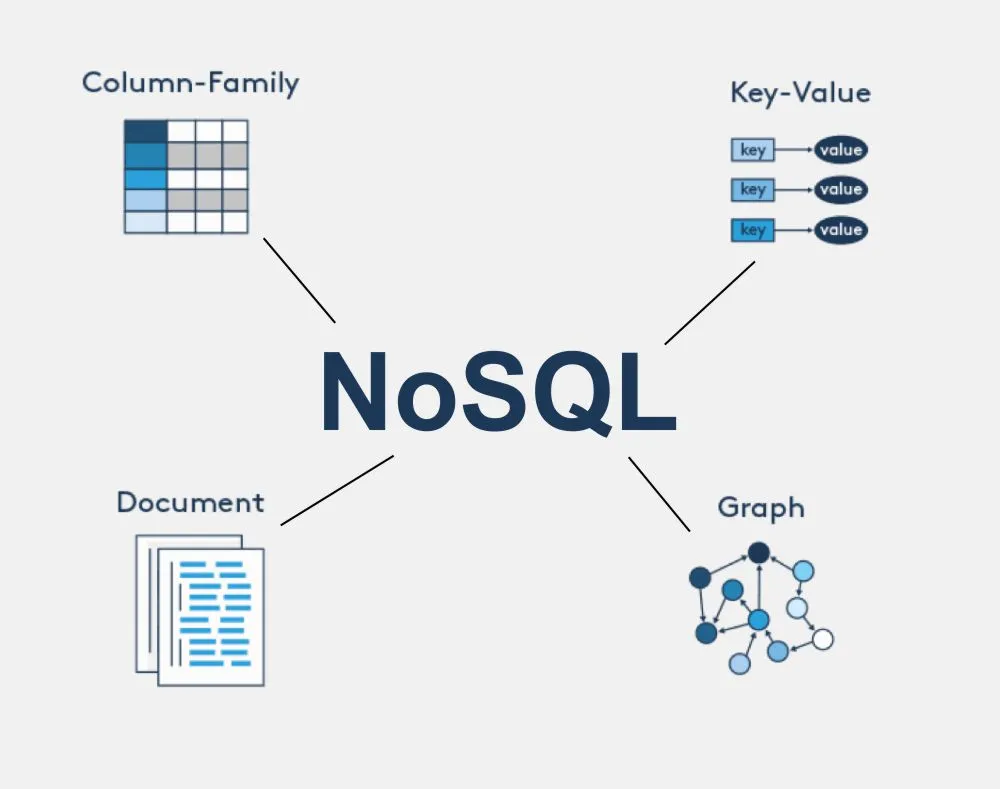

### 관계형 DB vs NoSQL

관계형 DB는 관계형 데이터베이스이고 NoSQL는 비관계형 데이터베이스이다.

우선 관계형 데이터베이스와 비관계형 데이터베이스가 각각 무엇인지부터 알아보겠다. 

- 관계형 데이터베이스
    
    SQL 데이터베이스 ?
    
    관계형 ? → 데이터가 여러 테이블에 나눠 저장되지만, 서로 연결 되어있어 조회가 가능함
    
    특징
    
    - 테이블 형태로 데이터를 관리
    - 데이터의 일관성과 무결성을 유지
        - 일관성: 데이터가 저장될 때 항상 올바른 상태로 유지되는 것 (고객 id에 중복된 값이 저장되지 않아야 함)
        - 무결성: 데이터가 손상되지 않고 정확하게 저장되는 것 (고객정보나 거래기록이 훼손되지 않아야 함)
    - 복잡한 쿼리 처리 가능
    
    MySQL
    
    : 오픈 소스 기반, 가장 많이 사용되는 관계형 데이터베이스 시스템, 웹 개발, 속도 유연성에 강점
    
    PostgreSQL
    
    : 데이터무결성과 복잡한 쿼리처리에 강점
    
    ORACLE
    
    : 대규모 기업 환경, 상업용, 고성능
    
    ```sql
    -- sql 쿼리 예시
    SELECT * FROM Users WHERE name = 'hana';
    ```
    
    - 정형화된 데이터
    - 복잡한 관계를 다루는 경우
    - 데이터 무결성과 일관성이 중요한 경우
        
        → SQL 데이터베이스 활용 
        
    
- 비관계형 데이터베이스
    
    NoSQL 데이터베이스 ? → Not only SQL
    
    : 관계형 테이블 대신 유연한 데이터 구조를 사용하는 비관계형 데이터베이스 관리 시스템
    
    테이블 형식 대신 문서, 키와 값, 그래프 등 다양한 구조로 데이터를 저장
    
    ex. sns에서 사용자 프로필, 게시물, 댓글 등을 각기 다른 형식으로 저장할 때 NoSQL을 사용하면 더 유연하게 관리할 수 있음
    
    특징 
    
    - 대량의 데이터를 빠르게 처리하는데 강점
    - 다양한 데이터 저장 형식
        
        
        
        - ex. 온라인게임 → 사용자 프로필 : 문서 / 아이템 정보 : 키와 값 / 채팅 : 로그 형식
    - 유연한 스키마
        - 스키마 ? : 데이터베이스에서 데이터의 구조와 형식을 정의하는 규칙
    - 빠른 확장성과 성능
    
    mongoDB
    
    :  문서 기반 NoSQL 데이터베이스, 데이터를 JSON 형식으로 저장
    
    - JSON ? : 키와 값이 쌍으로 이루어진 데이터
    
    → 유연한 구조, 스키마 변경없이 데이터를 쉽게 추가할 수 있어 웹/빅데이터 등 많이 사용
    
    cassandra
    
    : 분산 데이터베이스, 대량의 데이터를 여러 서버에 걸쳐 저장해 확장성과 내결함성이 뛰어남. 페북, 인스타 등 대규모 서비스에서 사용 
    
    redis
    
    : 키와 값 기반 데이터베이스, 매우 빠른 읽기 쓰기 성능을 제공, 주로 실시간 데이터 처리에 사용 
    
    - 비정형 데이터 (다양한 형식의 데이터)
    - 대규모 데이터 처리
    - 빠른 데이터 쓰기/읽기
        
        → NoSQL 데이터베이스 활용 
        
    

대규모 웹 애플리케이션의 경우 SQL과 NoSQL을 함께 사용함

- SQL : 주분 정보나 고객 정보 → 테이블로 관리
- NoSQL : 비정형 데이터나 빠르게 변화하는 데이터 적합, 대량의 사용자 트래픽을 처리, 리뷰 시스템(고객리뷰, 댓글 등), 추천 시스템(실시간 상품 추천)

→ 데이터를 더 안정적으로 관리가 가능 

### 클러스터링

군집화 ?

정처기에서는 아래처럼 설명 

서버 클러스터링 : 두 대 이상의 서버를 하나의 서버처럼 운영하는 기술

클러스터링은 서버 이중화 및 공유 스토리지를 사용하여 서버의 고가용성을 제공함

- 가용성 ? : 시스템이 장애 없이 정상적으로 계속 운영 되는 것
- 고가용성 클러스터링
    - 하나의 서버에 장애가 발생하면 다른 노드(서버)가 받아 처리하여 서비스 중단을 방지
    - 일반적으로 언급되는 클러스터링이 고가용성 클러스터링
- 병렬 처리 클러스터링
    - 전체 처리율을 높이기 위해 하나의 작업을 여러 개의 서버에서 분산하여 처리
- RTO(Recovery Time Objective) : 목표 복구 시간, 비상사태 또는 업무 중단 시점으로부터 복구되어 가동될 때까지의 소요 시간을 의미
- RPO(Recovery Point Objective) : 목표 복구 시점, 비상사태 또는 업무 중단 시점으로부터 데이터를 복구할 수 있는 기준점을 의미

일반 검색 시에는 아래처럼 설명 

유사성 또는 패턴을 기반으로 하여 서로 다른 객체, 데이터 포인트, 관측 결과를 그룹 또는 클러스터로 구성하고 분류하는 비지도 머신 러닝 알고리즘

→ 데이터 간의 유사성을 기준으로 내부적으로는 유사하고 외부적으로는 서로 다른 집단을 형성 하는 것

- 지도 학습과 비지도 학습
    
    
    | 구분 | 지도 학습 | 비지도 학습 |
    | --- | --- | --- |
    | 정답 데이터 | 있음 | 없음 |
    | 예시 | 분류, 회귀 | 군집화 |
- K-평균 (K-Means)
    
    중심점과의 거리를 기반으로 미리 지정한 K개의 클러스터로 데이터를 분할하는 알고리즘
    
    > 중심점과 각각의 데이터들 사이의 거리를 반복적으로 계산해서 최적의 중심점, 클러스터를 찾음
    > 
    
    과정
    
    1. K개의 중심점(centroid) 설정
    2. 각 데이터를 가장 가까운 중심점에 할당
    3. 각 클러스터의 평균을 구해 중심점 갱신
    4. 중심점이 더 이상 변하지 않을 때까지 반복
    
    특징
    
    - Hard Clustering
        
        → 하나의 데이터는 반드시 하나의 군집에 속함
        
    - 속도가 빠름
    - K(군집 개수) 값을 미리 정해야 함
    - 이상치(outlier)에 민감
    - 구형(원형) 형태의 군집에서 잘 작동
        
- 계층적 군집화 (Hierarchical Clustering)
    
    트리 구조를 생성하여 데이터를 계층적으로 묶거나 분할, K(군집 개수) 를 미리 정하지 않아도 됨
    
    - 연결 기반(거리 기반)
    - 트리 구조로 표현
    - 단계적으로 묶거나(병합) 나눔(분할)
        - **병합적(Agglomerative)** : 아래에서 위로 합침
        - **분할적(Divisive)** : 위에서 아래로 나눔
- 밀도 기반 군집화 (DBSCAN)
    
    데이터의 밀도(density)를 기준으로 분할하는 클러스터링 유형
    
    → 복잡한 모양의 군집 탐지 가능
    
    → 이상치 자동 탐지 가능
    
    - ε (eps) : 반경
    - MinPts : 최소 점 개수
    - Core Point : 반경 내 점이 MinPts 이상인 중심점
    - Noise : 어떤 군집에도 속하지 않는 점
    
    특징
    
    - K값을 미리 정할 필요 없음
    - 불규칙한 모양의 군집 탐지 가능
    - 이상치에 강함
    - 파라미터 설정이 중요함

### 레플리케이션

레플리케이션을 쳤더니 레플리케이션 vs 클러스터링 글이 많이 떠서 한 번에 찾아볼 걸 이라고 후회가 됐다. 아무튼 

레플리케이션 ? 

하나의 DB를 기준으로 동일한 데이터를 다른 DB 서버에 복제하여 운영하는 기술

→ 원본 DB + 복사본 DB를 실시간(또는 거의 실시간)으로 동기화하는 것


왜 사용할까 ?

- 읽기 성능 향상 (부하 분산)
- 데이터 백업
- 장애 대비
- 서비스 안정성 확보

두 개 이상의 DBMS 시스템이 동일한 데이터를 나누어 저장

| **기준이 되는 서버** | **또 다른 서버** |
| --- | --- |
| Master | Slave |
| Primary | Secondary |
| Leader | Replica |

요즘은 Master-Slave는 잘 사용하지 않는다고 강의 시간에 들었다. 

동작

1. 애플리케이션이 DB에 SQL 요청 (INSERT / UPDATE / DELETE)
2. **Primary 서버가 먼저 처리**
3. 처리된 변경 내용을 Secondary 서버로 전달
4. Secondary 서버가 동일하게 반영
5. 두 서버의 데이터가 동일하게 유지됨

핵심

- 쓰기(Write) → Primary에서만 수행
- 읽기(Read) → 보통 Secondary에서 분산 처리 가능
    
    → 읽기 성능 향상에 매우 효과적
    

구조 형태

- Secondary 서버는 1개일 수도 있고
- 여러 개일 수도 있음

```
        Primary
           │
   ┌───────┼───────┐
Secondary Secondary Secondary
```

→ 읽기 부하가 많을수록 Secondary를 늘림

종류(간단)

- 동기식 (Synchronous)
    - Primary와 Secondary가 동시에 반영
    - 데이터 정합성 높음
    - 성능 저하 가능
- 비동기식 (Asynchronous)
    - Primary가 먼저 반영 후, 나중에 Secondary에 전달
    - 성능 좋음
    - 순간적인 데이터 차이 발생 가능

### 수직 파티셔닝 (vertical)

- 파티셔닝 ? : 하나의 큰 테이블을 더 작은 단위의 테이블(파티션)로 나누는 것
    
    → 성능 향상 + 관리 효율성 증가
    

| vertival partitioning | column을 기준으로 table을 나누는 방식 |
| --- | --- |
| horizontal partitioning | row를 기준으로 table을 나누는 방식 |
- vertical partitioning
    - 테이블의 열(Column)을 기준으로 분할
    - 자주 조회되는 컬럼과 잘 사용되지 않는 컬럼을 분리
    - ex. ARTICLE 테이블에서 자주 조회 되는 컬럼과 별도 분리, 게시판 내용은 다른 테이블로 (게시판 내용은 용량이 커 부하도 큼)
    
    
    
    → 
    
    
    
    - 장점 : 캐시 적중률 향상, I/O 감소
    - 단점 : 조인 비용 증가, 트랜잭션 분산
    
    > 정규화(normalization)와 비슷하지만 목적이 다름
    > 
    > 
    > 정규화는 데이터 중복 제거가 주 목적이고, 수직 파티셔닝은 성능 최적화가 주 목적
    > 

- Horizontal Partitioning
    - 행(Row) 기준 분할
    - 특정 컬럼 값에 따라 분할
    - 종류 :
        - Range Partitioning : 값 범위 기준 (예: 날짜)
        - Hash Partitioning : 해시값 기준 → 균등 분산
        - List Partitioning : 명시된 값 기준 (ex: 지역명)
    - 장점 : 데이터 크기 분산, 특정 파티션만 조회 가능 → 성능 향상
    - 단점 : 파티션 설계 오류 시 성능 악화, 파티션 추가 시 재조정 어려움

### 샤딩 (수평 파티셔닝, horizontal)

- 샤딩 ?
    
    수평 파티셔닝을 넘은 아예 DB 인스턴스 단위로 분산
    
    샤딩은 DB 자체를 여러 개로 나눠 독립적으로 운영
    
    파티셔닝 + 인프라 분산
    
    - 특징 :
        - 샤드 키 (shard key): 분산 기준 컬럼 (ex. user_id, region)
        - 샤드 (shard): 각각 독립된 DB 인스턴스
        - 샤딩 라우터: 요청을 알맞은 샤드로 전달하는 컴포넌트 (middleware 또는 application logic)
    - 장점 :
        - 확장성 (Scalability) 우수 → 샤드를 추가하면 성능 선형 증가 가능
        - 장애 격리 → 하나의 샤드에 문제가 생겨도 전체 장애로 이어지지 않음
    - 단점:
        - Cross-shard Join 어려움
        - 트랜잭션 처리 복잡 → 분산 트랜잭션 필요 (2PC 등)
        - 운영/배포 복잡성 증가
    
    | 구분 | 파티셔닝 | 샤딩 | 리플리케이션 |
    | --- | --- | --- | --- |
    | 분할 대상 | 테이블 | 데이터베이스 | 전체 DB 복제 |
    | 목적 | 성능 개선, 관리 편의 | 확장성, 부하 분산 | 고가용성, 읽기 부하 분산 |
    | 데이터 분산 | 한 DB 내부 | 여러 DB 서버 | 동일한 데이터 복제 |
    | 쓰기 처리 | 하나의 DB | 각각의 샤드 | Primary에서만 처리 |
    | 읽기 처리 | 단일 DB | 각 샤드 별 처리 | Replica 분산 가능 |
    | 단점 | 파티션 설계 복잡 | 트랜잭션/조인 어려움 | 쓰기 확장 어려움 |

### SQL Injection

SQL Injection은 데이터베이스 보안 취약점 중 가장 대표적인 공격 기법

사용자 입력이 SQL 문에 제대로 검증되지 않은 채 포함되면, 공격자가 악의적인 SQL 코드를 삽입해 실행할 수 있습니다.

→ 사용자 입력값에 악성 SQL 코드를 포함시켜 DB에 전달함으로써,

→ 의도하지 않은 쿼리 실행/데이터 변경/삭제/정보 유출 등을 유발하는 공격

DB 엔진은 입력된 SQL 문자열을 그대로 실행하기 때문에, 공격이 성공하면 위험한 결과를 불러옴

> 사용자가 입력한 값이 그대로 SQL 명령으로 조합되어 쿼리 구조 자체가 바뀌어 버리는 보안 취약점
> 

작동

일반적인 웹 애플리케이션은 사용자 입력을 받아 SQL 문자열을 만들고 DB에 전달한다.

공격자는 이 과정에서 입력값에 SQL 코드를 숨어 넣어, 서버가 그 코드도 사용하도록 만든다.

ex. 

```sql
SELECT*FROM OrdersTable
WHERE ShipCity='Redmond';
```

이 쿼리에 공격자가 아래처럼 입력하면 :

```sql
Redmond'; DROP TABLE OrdersTable --
```

실제로 실행되는 SQL은 다음과 같다 :

```sql
SELECT*FROM OrdersTable
WHERE ShipCity='Redmond';
DROPTABLE OrdersTable--'
```

→ OrdersTable이 **삭제되어 버릴 수 있음**

SQL Injection이 가능한 이유

1. 사용자 입력을 SQL 코드와 구분하지 않고 그대로 사용
    
    공격자는 데이터가 아니라 **SQL 코드로 해석되도록 입력을 조작할 수 있음**
    
2. 입력 데이터에 대한 유효성 검증 부족
    - 입력값 길이, 형식 검증이 없거나
    - 특수문자나 쿼리 구분자를 검사하지 않음
3. 사용자 입력을 그대로 문자열로 연결
    - 문자열 결합 방식의 SQL 쿼리는 특히 취약함
    

ex.

```sql
SELECT*FROM Users
WHERE username='사용자입력';
```

공격자가 아래 입력을 주면 :

```sql
admin' OR 1=1 --
```

실행되는 쿼리는 :

```sql
SELECT*FROM Users
WHERE username='admin'OR1=1--';
```

→ 조건이 항상 참이 되어 로그인 우회, 데이터 조회 등 악용될 수 있음

SQL Injection 방어 방법 !

1. 모든 입력값을 검증한다
    - **길이, 형식, 범위**를 확인
    - 허용되지 않는 특수문자 처리
    - 예상되는 값 외에는 거부
2. SQL 문 구성 시 사용자 입력을 직접 연결하지 않는다.
    
    **문자열 결합 방식**은 위험하다.
    
    반드시 매개변수화된 쿼리 또는 별도의 바인딩 방식을 사용한다.
    
3. 안전한 API를 사용한다
    - 파라미터화된 쿼리
    - 저장 프로시저 with parameters
    - ORM 프레임워크 활용
    
    이런 기법들은 데이터가 SQL 코드로 해석되지 않도록 분리한다.
    
4. 최소 권한 원칙을 적용한다
    
    DB 사용자 계정에 불필요한 권한(예: DROP, ALTER)을 부여하면 안된다. 
    
5. 계층별 입력 검증 적용
    
    클라이언트뿐 아니라 서버, DB 서버까지 다중 레벨에서 입력 유효성 검사를 적용해야 한다.
    

만약, 공격이 성공하면, 

SQL Injection이 성공하면 다음과 같은 위험이 발생할 수 있다. 

- 사용자 데이터 무단 노출
- 데이터베이스 구조 변경 또는 삭제
- 인증 우회 및 관리자 계정 접근
- 시스템 전체 권한 획득

### 대용량 테이블 고려

대용량 테이블(수백만~수억 건 이상)은 일반적인 CRUD 설계로는 성능을 유지하기 어렵다.

문제는 단순하다:

> 데이터가 많아질수록 조회 범위와 디스크 I/O가 급격히 증가한다.
> 

따라서 설계 단계에서 성능을 전제로 구조를 잡아야 한다.

1. 인덱스 전략
    
    왜 인덱스 전략을 사용하는지 : 
    
    테이블이 커질수록 Full Scan 비용이 급격히 증가한다.
    
    인덱스가 없으면 모든 데이터를 순차 탐색한다.
    
    고려 사항
    
    - WHERE 절에 자주 사용되는 컬럼
    - JOIN 조건 컬럼
    - ORDER BY 컬럼
    
    주의점
    
    - 인덱스는 읽기 성능을 향상시키지만
    - INSERT / UPDATE / DELETE 시 인덱스도 갱신되므로 쓰기 성능이 저하된다.
    - 너무 많은 인덱스는 오히려 성능 악화
    
    → 읽기 중심 시스템인지, 쓰기 중심 시스템인지에 따라 전략이 달라진다.
    
2. 파티셔닝
    
    대용량 테이블의 대표적인 해결 방법이다.
    
    수평 파티셔닝 (Row 기준)
    
    ex. 날짜 기준 로그 테이블 분리
    
    ```
    orders_2024
    orders_2025
    ```
    
    → 특정 기간 조회 시 전체 테이블 스캔 방지
    
    → 관리 및 백업 효율 증가
    

- 수직 파티셔닝 (Column 기준)
    
    TEXT, BLOB 등 대용량 컬럼 분리
    
    ex. 
    
    - 기본 정보 테이블
    - 상세 내용 테이블
    
    → 불필요한 디스크 I/O 감소
    

1. 쿼리 설계 전략
    
    SELECT * ❌ ❌ 
    
    : 불필요한 컬럼까지 모두 조회
    
    → 네트워크 비용 증가
    
    → 메모리 사용 증가
    
    필요한 컬럼만 명시 !
    

1. 페이징 전략
    
    OFFSET 방식 ❌ ❌
    
    ```sql
    LIMIT10 OFFSET100000
    ```
    
    OFFSET이 커질수록 앞 데이터를 모두 스캔 후 버려야 하므로 매우 느려진다.
    
    - Keyset Pagination
        
        ```sql
        WHERE id>100000
        ORDERBY id
        LIMIT10
        ```
        
        → 인덱스 활용 가능
        
        → 일정한 성능 유지
        

1. 캐시 전략
    
    DB를 매번 조회하지 않고 캐시 서버 활용
    
    - Redis
    - Memcached
    
    → DB 부하 감소
    
    → 응답 속도 향상
    

### Statement, PreparedStatement

JDBC 기준

- Statement
    
    SQL을 문자열 형태로 직접 실행하는 방식
    
    ```sql
    Statementstmt=conn.createStatement();
    ResultSetrs=stmt.executeQuery(
    "SELECT * FROM users WHERE id = '"+id+"'"
    );
    ```
    
    특징
    
    - 실행 시마다 SQL을 파싱하고 실행 계획 수립
    - 문자열 결합 방식
    - SQL Injection 취약
    
    문제점
    
    1. 사용자 입력이 SQL 구조에 직접 포함됨
    2. 매번 쿼리 컴파일 → 성능 저하
    3. 가독성 낮음

- PreparedStatement
    
    미리 SQL 구조를 컴파일해 두고 값만 바인딩하는 방식
    
    ```sql
    PreparedStatementpstmt=
    conn.prepareStatement("SELECT * FROM users WHERE id = ?");
    pstmt.setString(1,id);
    ResultSetrs=pstmt.executeQuery();
    ```
    

- 내부 동작 차이

Statement 실행 과정

1. SQL 문자열 생성
2. DB로 전송
3. 파싱
4. 실행 계획 생성
5. 실행

→ 실행할 때마다 반복

PreparedStatement 실행 과정

1. SQL 구조 먼저 컴파일
2. 실행 계획 캐싱
3. 값만 바인딩
4. 실행

→ 반복 실행 시 성능 향상

- 보안 차이
    
    PreparedStatement는
    
    - SQL 구조와 데이터가 분리됨
    - 파라미터는 값으로만 처리
    - 쿼리 구조 변경 불가
    
    따라서 SQL Injection 방어 가능
    

- 성능 차이
    - 반복 실행 시 PreparedStatement가 유리
    - 실행 계획 재사용 가능
    - DB 부하 감소
    
- 비교 정리

| 구분 | Statement | PreparedStatement |
| --- | --- | --- |
| SQL Injection | 취약 | 안전 |
| 실행 계획 재사용 | 불가 | 가능 |
| 성능 | 낮음 | 높음 |

### Redis, Memcached

1차 프로젝트에서 Redis를 사용했어서 느낌은 알지만, 자세히는 모르고 Memcached는 처음 들어봤다. 유튜브에 쳐보니 둘을 비교하는 외국 영상이 엄청 많다. 

두 시스템 모두 인메모리 기반 캐시 시스템이지만 설계 철학과 기능 범위가 다르다고 한다. 

- Redis
    
    Key-Value 기반
    
    하지만 단순 문자열뿐 아니라 다양한 자료구조 지원:
    
    - String
    - List
    - Set
    - Hash
    - Sorted Set
    - Bitmap
    - Stream
    
    특징
    
    - 영속성(Persistence) 지원
        - RDB (Snapshot 방식)
        - AOF (Append Only File)
        
        메모리 데이터이지만 디스크 저장 가능
        
    - 단일 스레드 기반
        
        경합이 적고 구조가 단순
        
    - 다양한 활용
        - 세션 저장
        - 실시간 랭킹 시스템
        - 채팅
        - Pub/Sub
        - 분산 락 구현
- Memcached
    
    단순 Key-Value 저장소
    
    - 문자열 기반
    - 영속성 없음
    - 메모리 기반
    
    특징
    
    - 구조 단순
    - 매우 가벼움
    - 캐시 용도에 최적화
    
    하지만 자료구조 기능이 없고, 데이터 복구 기능이 없다.
    

| 구분 | Redis | Memcached |
| --- | --- | --- |
| 자료구조 | 다양 | 단순 문자열 |
| 영속성 | 지원 | 미지원 |
| 확장성 | 클러스터 지원 | 분산 캐시 |
| 활용 범위 | 캐시 + 메시징 + 세션 | 단순 캐시 |
| 복잡도 | 높음 | 낮음 |

### Elastic search

검색 최적화? 이건 인프런 강의가 엄청 많이 나와서 시간상 elastic search가 무엇인지만 정리하고 마무리 해야겠다. 

elastic search ?

오픈 소스 분산, RESTful 검색 및 분석 엔진, 확장 가능한 데이터 저장소 및 벡터 데이터베이스

→ 검색과 데이터 분석에 최적화된 데이터 베이스 !!

- 데이터 수집 및 분석
    
    elastic search는 대규모 데이터(ex. 로그 등)를 수집 및 분석하는 데 최적화되어 있고 elastic search(데이터 저장), logstash(데이터 수집 및 가공), kibana(데이터 시각화)를 같이 활용해 데이터를 수집 및 분석한다.
    
- 검색 최적화
    
    elastic search는 데이터가 많더라도 뛰어난 검색 속도를 가지고 있고 오타나 동의어를 고려해서 유연하게 검색할 수 있는 기능을 가지고 있다. 쿠팡이나 배민의 검색 기능도 전부 elastic search를 활용해 구현되어 있다. 
    

작동

cli 활용 —sql문→ MySQL

Postman, cURL 활용 —REST API→ Elasticsearch

: MySQL과 소통하려면 SQL문이라는 방식으로 통신해야 하는데, 비슷하게 Elasticsearch와 소통하려면 REST API라는 방식으로 통신해야 한다.

```sql
-- MySQL
INSERT INTO users (name, email) VALUES ('hana', 'hana@example.com');

--- Elasticsearch
curl -X POST "localhost:9200/users/_doc" -H 'Content-Type: application/json' -
{
	"name": "hana",
	"email": "hana@example.com"
}
```

대표적인 GUI 툴 : Kibana